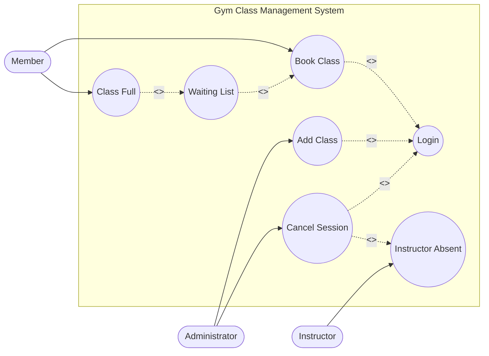
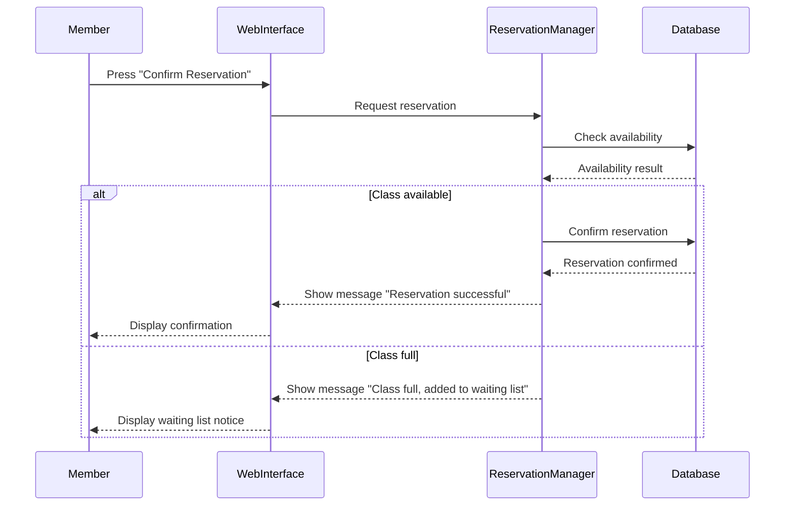
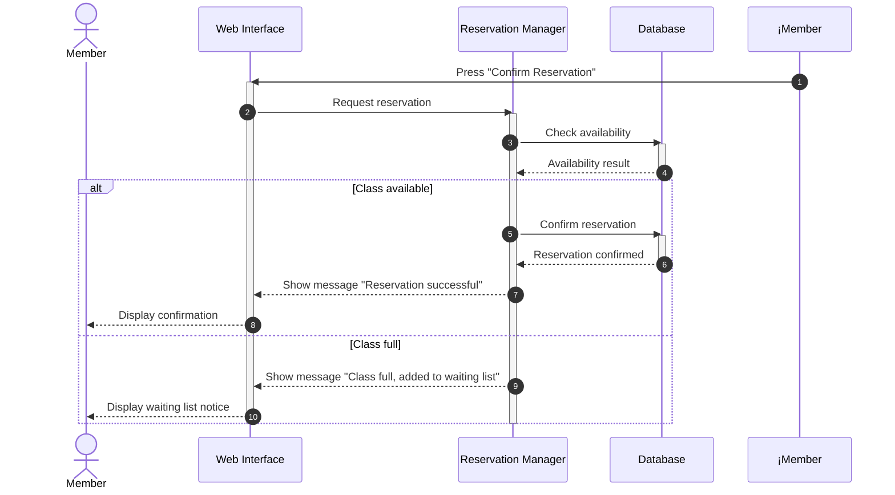
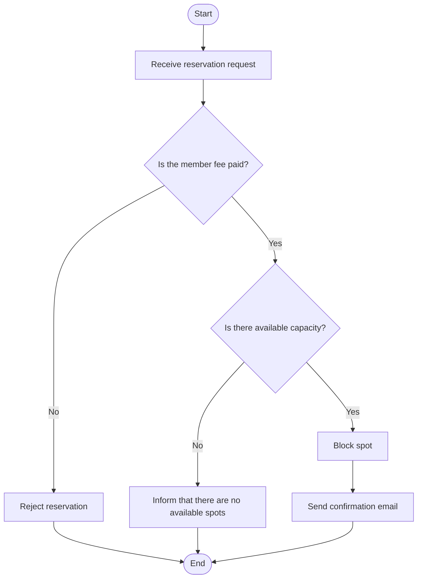

# Entornos-7.5

Caso de uso del ejercicio 1



Ejercicio 2. Parte 1



Ejercicio 2. Parte 2


Ejercicio 3 en inglés


Ejercicio 4 en inglés

´´´mermaid
stateDiagram-v2

[*] --> Pending : createReservation()

Pending --> Confirmed : confirm()
Pending --> Cancelled : cancel()

Confirmed --> Cancelled : cancel()
Confirmed --> Completed : checkIn()
Confirmed --> No_Show : noShow()

Completed --> [*]
Cancelled --> [*]
No_Show --> [*]
```
